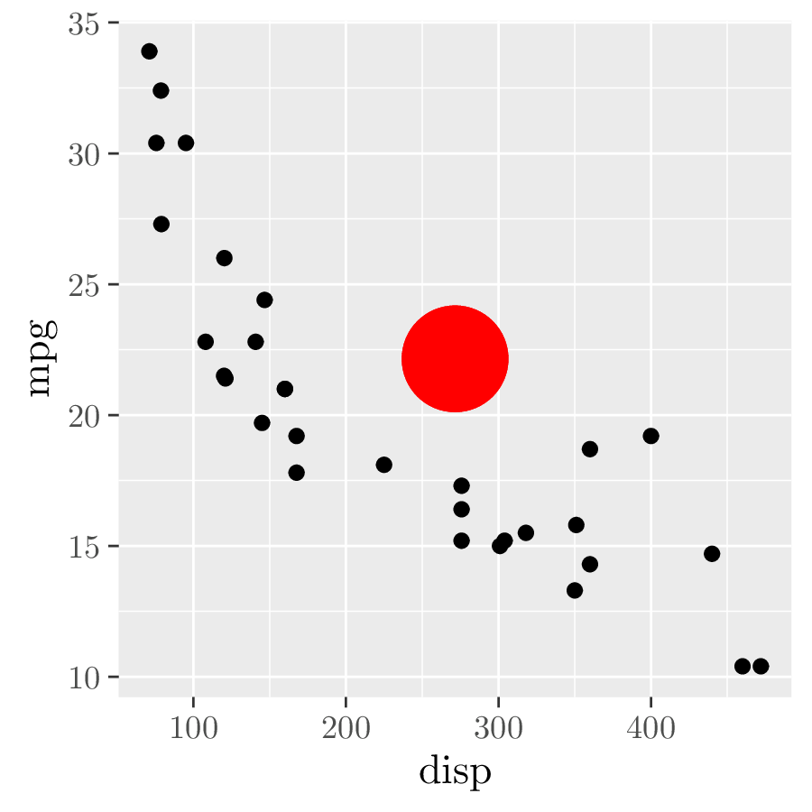

<!-- README.md is generated from README.Rmd. Please edit that file -->

# ggtikz

<!-- badges: start -->

[](https://codecov.io/gh/osthomas/ggtikz)
[](https://github.com/osthomas/ggtikz/actions)
<!-- badges: end -->

ggtikz allows you to annotate plots created using
[ggplot2](https://ggplot2.tidyverse.org/) with arbitrary TikZ code when
rendering them with the
[tikzDevice](https://cran.r-project.org/web/packages/tikzDevice). The
annotations can be made using data coordinates, or with coordinates
relative to a specified panel or the whole plot.

Plots with multiple panels (via `facet_grid()` or `facet_wrap()`) are
supported.

For a few examples, see the [examples vignette](doc/examples.pdf).

## Installation

You can install ggtikz from github with:

``` r
devtools::install_github("osthomas/ggtikz")
```

## Basic Usage

1.  Create a ggplot.
2.  Add annotations with `ggtikz()`.

``` r
library(ggplot2)
library(ggtikz)

p <- ggplot(mtcars, aes(disp, mpg)) + geom_point() # 1.
## tikz("plot.tikz")
ggtikz(p,
    "\\fill[red] (0.5,0.5) circle (5mm);",
    xy = "plot")
## dev.off()
## Render with LaTeX ...
```



## Advanced Usage

1.  Create a ggplot.
2.  Create a ggtikz canvas from the plot with `ggtikzCanvas()`.
3.  Create ggtikz annotations with `ggtikzAnnotation()`.
4.  Add the annotations to the canvas.
5.  Draw the plot and the annotations using tikzDevice.

``` r
library(ggplot2)
library(ggtikz)

p <- ggplot(mtcars, aes(disp, mpg)) + geom_point()  # 1.
canvas <- ggtikzCanvas(p)                           # 2.
annot1 <- ggtikzAnnotation(                         # 3.
    "
    \\draw (0,0) -- (1,1);
    \\draw (0,1) -- (1,0);
    \\fill[red] (0.5,0.5) circle (5mm);
    ",
    xy = "panel", panelx = 1, panely = 1
)
annot2 <- ggtikzAnnotation(                          # 3.
    "\\draw[<-] (400,20) -- ++(0,3) node[at end, anchor=south] {(400,20)};",
    xy = "data", panelx = 1, panely = 1
)

## tikz("plot.tikz")
p                                                   # 4. + 5.
canvas + annot1 + annot2
## dev.off()
## Render with LaTeX ...
```


